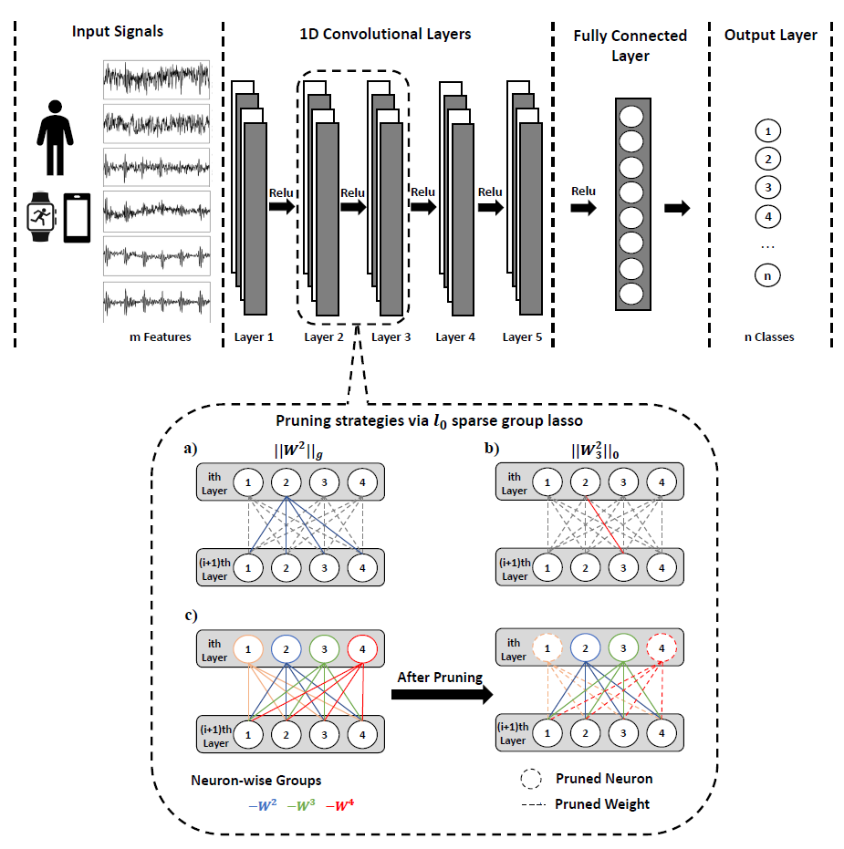

## Deep CNN Compression via l0 Sparse-Group Lasso on Human Activity Recognition using Smartphone 

### About
This directory contains the code and resources of the following paper:

*"Deep CNN Compression via l0 Sparse-Group Lasso on Human Activity Recognition using Smartphone".* Under review.Cancel changes

1. All the following works are implemented via Google Colab.

 - WISDM (code, data, model)

 - UCI-HAR (code, data, model)

 - PAMAP2 (code, data, model)

2. All the following works are implemented via Android Studio.
 - Android (code, data, model)
 
3. Please contact Yubo Shao shao111@purdue.edu if you have issues using the code.

### Overview of the Model

Our main objective is to obtain a sparse deep neural network with a significantly less number of parameters at both individual and group levels by using the proposed novel combined regularizer: l0 sparse group lasso.

For a particular neural network, if all the incoming and outgoing weights of a neuron are 0, then we can remove such an node to obtain a smaller model instead. We aim to prune a generic (deep) neural network, which includes fully connected feed-forward network (FCN) and one dimensional convolutional neural network (1D CNNs).

Here, we implemented l0 sparse group lasso along with other state-of-arts pruning methods such as l0 norm, 11 norm, l2 norm, group lasso and l1 sparse group lasso. And we compared the weights and nodes sparsity as well as the computational cost and battary consumptions of our proposed model and other state-of-arts models.

### Lience
The source code for the site is licensed under the MIT license, which you can find in the MIT-LICENSE.txt file.
