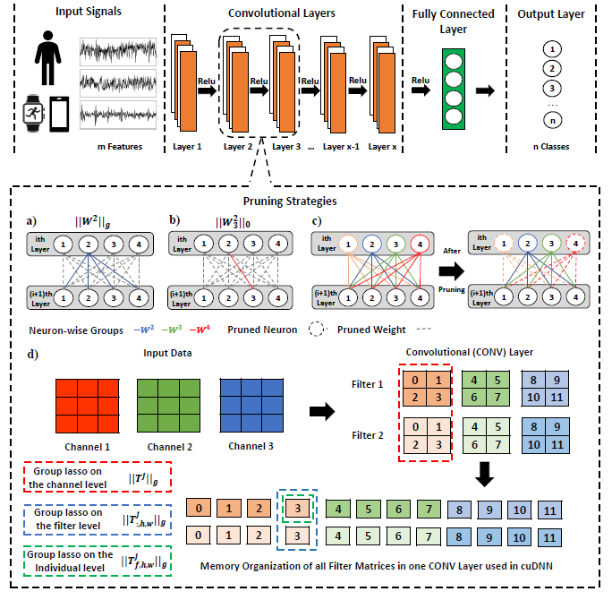

# MobilePrune: Neural Network Compression via ℓ0 Sparse Group Lasso on the Mobile System

## About
This directory contains the code and resources of the following paper:

*"MobilePrune: Neural Network Compression via ℓ0 Sparse Group Lasso on the Mobile System".* Under review.
1. All the following works are implemented by Python 3.6+ and PyTorch 1.4.
 - Image benchmarks

2. All the following works are implemented via Google Colab.
 - HAR benchmarks

 	-- WISDM (code, data, model)

 	-- UCI-HAR (code, data, model)

 	-- PAMAP2 (code, data, model)

3. All the following works are implemented via Android Studio.
 - Android (code, data, model)

## Overview of the Model

It is hard to directly deploy deep learning models on today’s smartphones due to the substantial computational costs introduced
by millions of parameters. To compress the model, we develop an ℓ0-based sparse group lasso model called MobilePrune
which is able to generate extremely compact neural network models for both desktop and mobile platforms. We adopt group
lasso penalty to enforce sparsity at the group level to benefit General Matrix Multiply (GEMM) and develop the very first
algorithm that can optimize the ℓ0 norm in an exact manner and achieve the global convergence guarantee in the deep learning
context. MobilePrune also allows complicated group structures to be applied on the group penalty (i.e., trees and overlapping
groups) to suit DNN models with more complex architectures. Empirically, we observe the substantial reduction of compression
ratio and computational costs for various popular deep learning models on multiple benchmark datasets compared to the
state-of-the-art methods. More importantly, the compression models are deployed on android system to confirm our approach
is able to achieve less response delay and battery consumption on mobile phones.

## License
The source code for the site is licensed under the MIT license, which you can find in the MIT-LICENSE.txt file.
